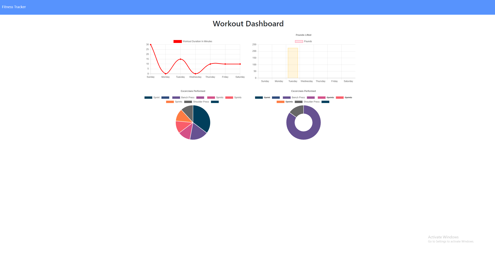

# Fitness Tracker App

## Description:
Track your workouts with my easy to use fitness tracker! You can input what type of workout you're doing, the name of the exercise, how much weight you're lifting or how far you're running, the duration of the exercise, and how many reps. You can add multiple exercises to your workout and track your progress!

## Table of Contents:

* [Installation](#installation)
* [Information](#Information)
* [License](#license)
* [Contributing](#contributing)
* [Tests](#Tests)
* [Questions](#questions)

## Installation

To install all necessary dependencies, run the following command:

" npm i "

## Information

The application is deployed on Heroku

Link to app on Heroku: [Here](https://cody-workout-tracker.herokuapp.com/)

## License

This project is licensed under the MIT license.

## Contributing

To contribute to this repo, create a pull request!

## Tests

To run tests on the repo, run the following command:

" npm test "

## Questions

If you have any questions or comments about the repo, please feel free to email me at ydoc118@gmail.com,
or visit my GitHub to see more of my work at [Ydoc118](https://github.com/Ydoc118)

## Image of Repo

     